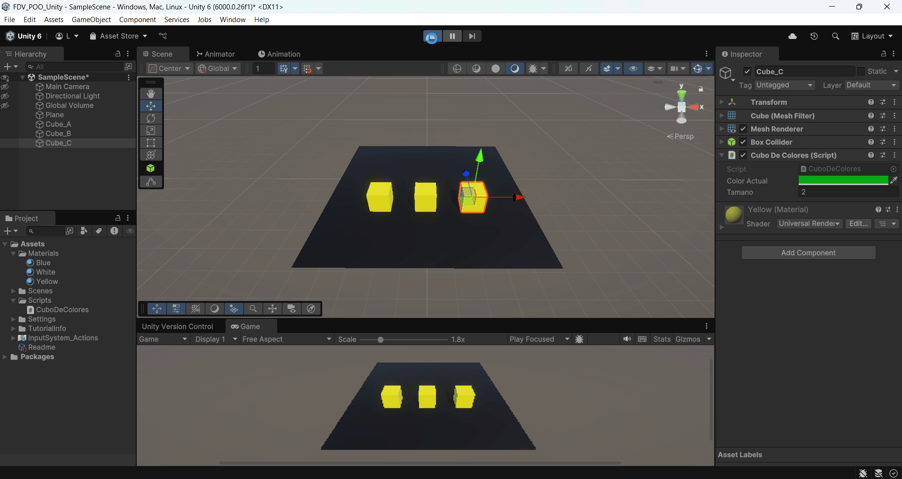
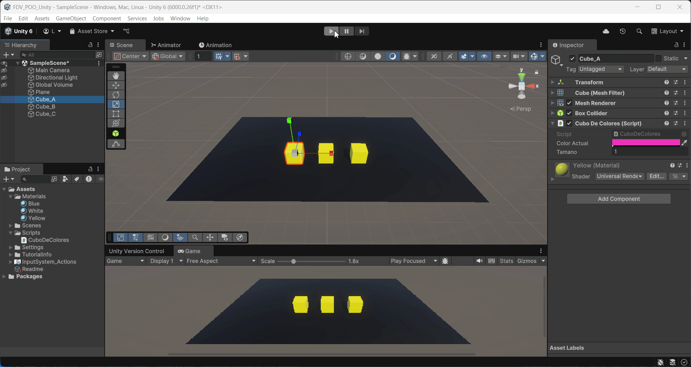

FDV_POO_Unity

```
>> PRACTICA:   Unity Project - POO with Unity
>> COMPONENTE: XueMei Lin
>> GITHUB:     https://github.com/XueMei-L/FDV_POO_Unity_01.git
>> Versión:    1.0.0
```

# Introducción a la POO con Unity

La **programación orientada a objetos (POO)** es una forma de organizar el código pensando en el mundo real.  
En lugar de tener un gran bloque de instrucciones, agrupamos el código en **objetos** que tienen:

- **Propiedades** → lo que son  
- **Comportamientos** → lo que hacen  

En Unity, ya trabajas con objetos, por ejemplo:  
- Un personaje  
- Una moneda  
- Un enemigo  

La POO ayuda a crear propios objetos con reglas personalizadas.

# Proceso de la práctica
## Ejercicio 1: Programando clases
1. crear una clase con el script llamado: ***CuboDeColores.cs***
2. Definir las propiedades:
    > **public Color color = Color.blue;** // Variable pública, representa el color del cubo.

    > **public float tamano = 1f;** // Variable pública, representa el tamaño del cubo.

    > **private Rigidbody rb;** // referencia al Rigidbody

    > **private Renderer r;**  // referencia al Renderer

    > **private Transform t;**  // referencia al Transform
3. Implementa el comportamiento inicial: Haz que el cubo tome el color que prefieras y un tamaño predeterminado.
    Crear un material amarillo, y asigna al cubo dicho color;
    En el script, implementa la función update() para rederizar luego el color o tamaño.
    
    ***CuboDeColores.cs***: 
    ```
    void Update()
    {
        // manipular el objeto rigidbody
        rb = GetComponent<Rigidbody>();

        // render y aplicar color
        GetComponent<Renderer>().material.color = colorActual;
        r = GetComponent<Renderer>();
        r.material.color = colorActual;

        // realizar transform y aplicar tamaño
        t = GetComponent<Transform>();
        t.localScale = Vector3.one * tamano;
    }
    ```

4. Usar la clase:

    1. Crear en la escena 3 cubos 3D

    

    2. Asignar el script ***CuboDeColores.cs*** a cada cubo

    

    3. En el Inspector de cada cubo, asigna un color y un tamaño diferente.Así, sin cambiar el código ya tenemos cubos únicos a partir de la misma plantilla.
    
    
    
    
    4. Ahora cuando damos **play** el tamaño de cubos se cambia.
    

    5. Ahora usamos el transform.position podemos modificar la posición de un cubo
    
    en el código he añadido una variable bool para que el cubo solo se mueva una vez.
    y mover su posición.
    ```
    // Ejemplo: si el cubo se llama "Cube_A", y no se ha movido, pues cambia su posición
        if (gameObject.name == "Cube_A" && !moved)
        {
            // aquí pusé un valor fijo, puede un número aleatorio.
            transform.position = new Vector3(transform.position.x - 3f,
                                            transform.position.y,
                                            transform.position.z);
            moved = true;
        }
    ```