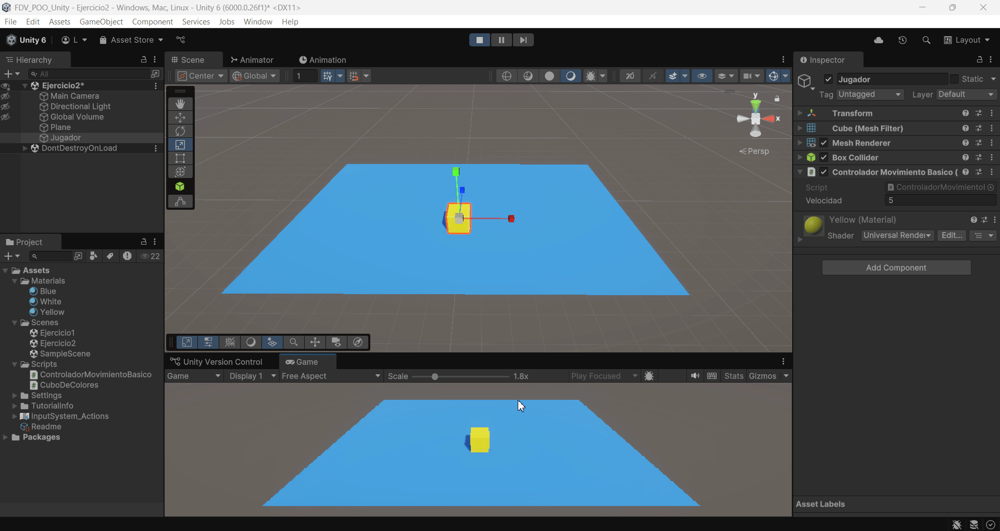

FDV_POO_Unity

```
>> PRACTICA:   Unity Project - POO with Unity
>> COMPONENTE: XueMei Lin
>> GITHUB:     https://github.com/XueMei-L/FDV_POO_Unity_01.git
>> Versión:    1.0.0
```

# Introducción a la POO con Unity

La **programación orientada a objetos (POO)** es una forma de organizar el código pensando en el mundo real.  
En lugar de tener un gran bloque de instrucciones, agrupamos el código en **objetos** que tienen:

- **Propiedades** → lo que son  
- **Comportamientos** → lo que hacen  

La POO ayuda a crear propios objetos con reglas personalizadas.

# Proceso de la práctica
## Ejercicio 1: Programando clases
### Objetivo: Comprender las clases y las propiedades

1. crear una clase con el script llamado: ***CuboDeColores.cs***
2. Definir las propiedades:
    > **public Color color = Color.blue;** // Variable pública, representa el color del cubo.

    > **public float tamano = 1f;** // Variable pública, representa el tamaño del cubo.

    > **private Rigidbody rb;** // referencia al Rigidbody

    > **private Renderer r;**  // referencia al Renderer

    > **private Transform t;**  // referencia al Transform
3. Implementa el comportamiento inicial: Haz que el cubo tome el color que prefieras y un tamaño predeterminado.
    Crear un material amarillo, y asigna al cubo dicho color;
    En el script, implementa la función update() para rederizar luego el color o tamaño.
    
    ***CuboDeColores.cs***: 
    ```
    void Update()
    {
        // manipular el objeto rigidbody
        rb = GetComponent<Rigidbody>();

        // render y aplicar color
        GetComponent<Renderer>().material.color = colorActual;
        r = GetComponent<Renderer>();
        r.material.color = colorActual;

        // realizar transform y aplicar tamaño
        t = GetComponent<Transform>();
        t.localScale = Vector3.one * tamano;
    }
    ```

4. Usar la clase:

    1. Crear en la escena 3 cubos 3D

    

    2. Asignar el script ***CuboDeColores.cs*** a cada cubo

    

    3. En el Inspector de cada cubo, asigna un color y un tamaño diferente.Así, sin cambiar el código ya tenemos cubos únicos a partir de la misma plantilla.
   
    
    
    
    
    4. Ahora cuando damos **play** el tamaño de cubos se cambia.
    

    5. Ahora usamos el transform.position podemos modificar la posición de un cubo
    
    en el código he añadido una variable bool para que el cubo solo se mueva una vez.
        ```
        // Si el cubo se llama "Cube_A", y no se ha movido, pues cambia su posición
        if (gameObject.name == "Cube_A" && !moved)
        {
            // aquí pusé un valor fijo, puede un número aleatorio.
            transform.position = new Vector3(transform.position.x - 3f,
                                            transform.position.y,
                                            transform.position.z);
            moved = true;
        }
        ```

## Ejercicio 2: Programando clases
### Objetivo: Entender cómo se manipula la posición y rotación de un objeto.

1. Agrear un cubo llamado jugador en la escena.
2. le asinamos un script llamado ***ControladorMovimientoBasico***
    

    ***ControladorMovimientoBasico.cs***
    
    En el script, se crea unaa variable publica ***velocidad*** para controlar la velocidad del movimiento del jugador

    ```
    public float velocidad = 5f;
    ```
    
    En la función ***Update()***, Usamos el ***Input.GetKey()*** para realizar el movimiento del jugador con el teclado.

    ***transform.Translate()*** para mover el objeto.

    ***Vector3*** para tener la dirección

    ```
    // Move forward by pressing W
    if (Input.GetKey(KeyCode.W))
    {
        transform.Translate(Vector3.forward * velocidad * Time.deltaTime);
    }
    ```
    Este código significa que cuando el usuario presiona el teclado w, se mueve hacia adelante. 
    
    Usamos ***Time.deltaTime*** para mover más sueve, esto significa el tiempo en segundos que ha pasado desde el último frame. (El movimiento no depende del FPS, sino depende del tiempo).
    
    Así con los demás.
    
    **W -> adelante**

    **S -> atrás**

    **A -> izquierda**

    **D -> derecha**


    ***
    ***ControladorMovimientoBasico.cs*** 
    
    Código completo
    ```
    using System.Security.Cryptography;
    using UnityEngine;

    public class ControladorMovimientoBasico : MonoBehaviour
    {
        public float velocidad = 5f; // Velocidad configurable desde el Inspector

        void Update()
        {
            // forward
            if (Input.GetKey(KeyCode.W))
            {
                transform.Translate(Vector3.forward * velocidad * Time.deltaTime);
            }
            // back
            if (Input.GetKey(KeyCode.S))
            {
                transform.Translate(Vector3.back * velocidad * Time.deltaTime);
            }
            // left
            if (Input.GetKey(KeyCode.A))
            {
                transform.Translate(Vector3.left * velocidad * Time.deltaTime);
            }
            // right
            if (Input.GetKey(KeyCode.D))
            {
                transform.Translate(Vector3.right * velocidad * Time.deltaTime);
            }
        }
    }

    ```
    
    Prueba del juego:

    

## Ejercicio 3: Depurando errores sintácticos
### Objetivo: Aprender a identificar y corregir errores de programación usando la consola de Unity.
1. Añadir el código en el script de ***ControladorMovimientoBasico.cs***
   
    ```
    transform.translate(2,1,1);
    ```
2. Miramos la consola que proporciona Unity, vemos que hay error en la dicha linea del código.
    

    ```
    Assets\Scripts\ControladorMovimientoBasico.cs(10,19): error CS1061: 'Transform' does not contain a definition for 'translate' and no accessible extension method 'translate' accepting a first argument of type 'Transform' could be found (are you missing a using directive or an assembly reference?)
    ```
    En el error indica que el componente ***Assets\Scripts\ControladorMovimientoBasico.cs*** está fallando por el movito de que no existe **translate** en **Trasform**, (puesto que Traslate se escribe con T mayúscula), por lo tanto no se encuentra, también nos indica que el error está en la linea (10,19).

## Ejercicio 4: Errores de ejecución
### Objetivo: Identificar un error de ejecución causado por una variable sin inicializar, que resulta en un comportamiento inesperado.
1. Crea un nuevo script llamado ***TestForRuntimeError.cs***
2. En él, escribimos lo siguiente código:
   ```
    using System.Security.Cryptography;
    using UnityEngine;

    public class TestForRuntimeError : MonoBehaviour
    {
        private Renderer rend;

        void Update()
        {
            rend.material.color = Color.blue;
        }
    }
    ```
    
    
    Nos da error a la hora de dar play el juego, eso debido a que está intentando usar una referencia nula, es decir, rend no apunta a ningún objeto, pero en la función ***Update()*** está llamando a él para cambiar el color.

3. Crear un cubo llamado ***CambiadorColorFantasma*** y otro script llamado ***ColorFantasma.cs***
   ***
   ***ColorFantasma.cs***: 

   ```
    using UnityEngine;
    public class ColorFantasma : MonoBehaviour
    {
        private Renderer rend;
        public Material materialFinal;
        void Start()
        {
            // ¡Esta línea está comentada a propósito!
            // rend = GetComponent<Renderer>();
        }
        void Update()
        {
            if (Input.GetKeyDown(KeyCode.Space))
            {
                rend.material = materialFinal;
            }
        }
    }
    ```

4. Análisis del Problema:
   1. Guardar el script, y volver a Unity.
   2. Asignar el script al objeto Cube ***CambiadorColorFantasma***
   3. Crear un material verbo, y asignar a la variable Material Final
   
   4. Ejercurtar el juego, y el cubo no cambia el color y sale un error de mensaje.
   
   Esto es porque **render** no apunta a ningún objeto, y sigue siendo **null**, para solucionarlo, simplementa descomentar el código **rend = GetComponent<Renderer>();** para inicializar el objeto.


