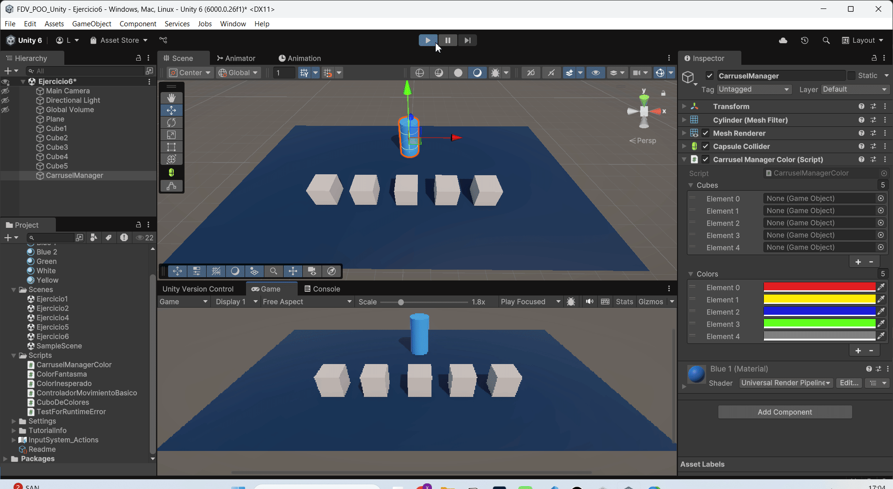

FDV_POO_Unity

```
>> PRACTICA:   Unity Project - POO with Unity
>> COMPONENTE: XueMei Lin
>> GITHUB:     https://github.com/XueMei-L/FDV_POO_Unity_01.git
>> Versión:    1.0.0
```

# Introducción a la POO con Unity

La **programación orientada a objetos (POO)** es una forma de organizar el código pensando en el mundo real.  
En lugar de tener un gran bloque de instrucciones, agrupamos el código en **objetos** que tienen:

- **Propiedades** → lo que son  
- **Comportamientos** → lo que hacen  

La POO ayuda a crear propios objetos con reglas personalizadas.

# Proceso de la práctica
## Ejercicio 1: Programando clases
### Objetivo: Comprender las clases y las propiedades

1. crear una clase con el script llamado: ***CuboDeColores.cs***
2. Definir las propiedades:
    > **public Color color = Color.blue;** // Variable pública, representa el color del cubo.

    > **public float tamano = 1f;** // Variable pública, representa el tamaño del cubo.

    > **private Rigidbody rb;** // referencia al Rigidbody

    > **private Renderer r;**  // referencia al Renderer

    > **private Transform t;**  // referencia al Transform
3. Implementa el comportamiento inicial: Haz que el cubo tome el color que prefieras y un tamaño predeterminado.
    Crear un material amarillo, y asigna al cubo dicho color;
    En el script, implementa la función update() para rederizar luego el color o tamaño.
    
    ***CuboDeColores.cs***: 
    ```
    void Update()
    {
        // manipular el objeto rigidbody
        rb = GetComponent<Rigidbody>();

        // render y aplicar color
        GetComponent<Renderer>().material.color = colorActual;
        r = GetComponent<Renderer>();
        r.material.color = colorActual;

        // realizar transform y aplicar tamaño
        t = GetComponent<Transform>();
        t.localScale = Vector3.one * tamano;
    }
    ```

4. Usar la clase:

    1. Crear en la escena 3 cubos 3D

    

    2. Asignar el script ***CuboDeColores.cs*** a cada cubo

    

    3. En el Inspector de cada cubo, asigna un color y un tamaño diferente.Así, sin cambiar el código ya tenemos cubos únicos a partir de la misma plantilla.
   
    
    
    
    
    4. Ahora cuando damos **play** el tamaño de cubos se cambia.
    

    5. Ahora usamos el transform.position podemos modificar la posición de un cubo
    
    en el código he añadido una variable bool para que el cubo solo se mueva una vez.
        ```
        // Si el cubo se llama "Cube_A", y no se ha movido, pues cambia su posición
        if (gameObject.name == "Cube_A" && !moved)
        {
            // aquí pusé un valor fijo, puede un número aleatorio.
            transform.position = new Vector3(transform.position.x - 3f,
                                            transform.position.y,
                                            transform.position.z);
            moved = true;
        }
        ```

## Ejercicio 2: Programando clases
### Objetivo: Entender cómo se manipula la posición y rotación de un objeto.

1. Agrear un cubo llamado jugador en la escena.
2. le asinamos un script llamado ***ControladorMovimientoBasico***
    

    ***ControladorMovimientoBasico.cs***
    
    En el script, se crea unaa variable publica ***velocidad*** para controlar la velocidad del movimiento del jugador

    ```
    public float velocidad = 5f;
    ```
    
    En la función ***Update()***, Usamos el ***Input.GetKey()*** para realizar el movimiento del jugador con el teclado.

    ***transform.Translate()*** para mover el objeto.

    ***Vector3*** para tener la dirección

    ```
    // Move forward by pressing W
    if (Input.GetKey(KeyCode.W))
    {
        transform.Translate(Vector3.forward * velocidad * Time.deltaTime);
    }
    ```
    Este código significa que cuando el usuario presiona el teclado w, se mueve hacia adelante. 
    
    Usamos ***Time.deltaTime*** para mover más sueve, esto significa el tiempo en segundos que ha pasado desde el último frame. (El movimiento no depende del FPS, sino depende del tiempo).
    
    Así con los demás.
    
    **W -> adelante**

    **S -> atrás**

    **A -> izquierda**

    **D -> derecha**


    ***
    ***ControladorMovimientoBasico.cs*** 
    
    Código completo
    ```
    using System.Security.Cryptography;
    using UnityEngine;

    public class ControladorMovimientoBasico : MonoBehaviour
    {
        public float velocidad = 5f; // Velocidad configurable desde el Inspector

        void Update()
        {
            // forward
            if (Input.GetKey(KeyCode.W))
            {
                transform.Translate(Vector3.forward * velocidad * Time.deltaTime);
            }
            // back
            if (Input.GetKey(KeyCode.S))
            {
                transform.Translate(Vector3.back * velocidad * Time.deltaTime);
            }
            // left
            if (Input.GetKey(KeyCode.A))
            {
                transform.Translate(Vector3.left * velocidad * Time.deltaTime);
            }
            // right
            if (Input.GetKey(KeyCode.D))
            {
                transform.Translate(Vector3.right * velocidad * Time.deltaTime);
            }
        }
    }

    ```
    
    Prueba del juego:

    

## Ejercicio 3: Depurando errores sintácticos
### Objetivo: Aprender a identificar y corregir errores de programación usando la consola de Unity.
1. Añadir el código en el script de ***ControladorMovimientoBasico.cs***
   
    ```
    transform.translate(2,1,1);
    ```
2. Miramos la consola que proporciona Unity, vemos que hay error en la dicha linea del código.
    

    ```
    Assets\Scripts\ControladorMovimientoBasico.cs(10,19): error CS1061: 'Transform' does not contain a definition for 'translate' and no accessible extension method 'translate' accepting a first argument of type 'Transform' could be found (are you missing a using directive or an assembly reference?)
    ```
    En el error indica que el componente ***Assets\Scripts\ControladorMovimientoBasico.cs*** está fallando por el movito de que no existe **translate** en **Trasform**, (puesto que Traslate se escribe con T mayúscula), por lo tanto no se encuentra, también nos indica que el error está en la linea (10,19).

## Ejercicio 4: Errores de ejecución
### Objetivo: Identificar un error de ejecución causado por una variable sin inicializar, que resulta en un comportamiento inesperado.
1. Crea un nuevo script llamado ***TestForRuntimeError.cs***
2. En él, escribimos lo siguiente código:
   ```
    using System.Security.Cryptography;
    using UnityEngine;

    public class TestForRuntimeError : MonoBehaviour
    {
        private Renderer rend;

        void Update()
        {
            rend.material.color = Color.blue;
        }
    }
    ```
    
    
    Nos da error a la hora de dar play el juego, eso debido a que está intentando usar una referencia nula, es decir, rend no apunta a ningún objeto, pero en la función ***Update()*** está llamando a él para cambiar el color.

3. Crear un cubo llamado ***CambiadorColorFantasma*** y otro script llamado ***ColorFantasma.cs***
   ***
   ***ColorFantasma.cs***: 

   ```
    using UnityEngine;
    public class ColorFantasma : MonoBehaviour
    {
        private Renderer rend;
        public Material materialFinal;
        void Start()
        {
            // ¡Esta línea está comentada a propósito!
            // rend = GetComponent<Renderer>();
        }
        void Update()
        {
            if (Input.GetKeyDown(KeyCode.Space))
            {
                rend.material = materialFinal;
            }
        }
    }
    ```

4. Análisis del Problema:
   1. Guardar el script, y volver a Unity.
   2. Asignar el script al objeto Cube ***CambiadorColorFantasma***
   3. Crear un material verbo, y asignar a la variable Material Final
   
   4. Ejercurtar el juego, y el cubo no cambia el color y sale un error de mensaje.
   
   Esto es porque **render** no apunta a ningún objeto, y sigue siendo **null**, para solucionarlo, simplementa descomentar el código **rend = GetComponent<Renderer>();** para inicializar el objeto.


## Ejercicio 5: Error en la lógica del programa.
### Objetivo: Identificar un error lógico donde una variable tiene un valor incorrecto, impidiendo el resultado esperado.

**Escenario**: Un programador junior ha escrito un script para que un cubo cambie de color a azul cuando el usuario presione una tecla. Sin embargo, al ejecutar el juego, el cubo se vuelve rojo. El código no produce ningún error en la consola, pero el resultado es incorrecto. Tu misión es descubrir por qué.

1. Un nueva escena con el cubo llamado ***CuboInesperado*** y un script llamado ***ColorInesperado.cs***
    ***
    ***ColorInesperado.cs***
    ```
    using UnityEngine;
    public class ColorInesperado : MonoBehaviour
    {
        private Renderer rend;
        public Color colorEsperado;
        void Start()
        {
            rend = GetComponent<Renderer>();
            // Asignamos un valor incorrecto a la variable
            colorEsperado = Color.red;
        }
        void Update()
        {
            if (Input.GetKeyDown(KeyCode.Space))
            {
                // Intentamos cambiar el color del material al valor de la variable
                rend.material.color = colorEsperado;
            }
        }
    }
    ```
    Cuando damos al play el juego, el cubo se cambia a rojo.
    

2. Método de Depuración: ahora vamos a depurar.
   1. Paso 1: ¿El código se ejecuta? La falta de un error en la consola significa que el código no tiene problemas de sintaxis ni NullReferenceException. El programa se está ejecutando correctamente.**[Verificado]**
   2. Paso 2: ¿La lógica es correcta? El problema es lógico. La única línea que asigna un valor a la variable colorEsperado es colorEsperado = Color.red;
   3. Paso 3: Inspección en el editor. A pesar de que la variable colorEsperado es pública, está siendo sobrescrita en la función Start() con el valor Color.red.
   4. Paso 4: El Debug.Log() es tu amigo. Para confirmar tus sospechas, añade una línea de código para imprimir el valor de la variable en la consola.
    ```
    Debug.Log("El color que se asignará es: " + colorEsperado);
    ```
    

3. Identificación y Solución: 
   La línea **colorEsperado = Color.red**; es la causa del problema. Está asignando directamente un valor fijo de rojo. ○ Elimina la línea **colorEsperado = Color.red**; por completo. Al ser la variable colorEsperado pública, puedes asignarle el color azul (o cualquier otro) directamente desde el Inspector de Unity antes de iniciar el juego.


## Ejercicio 6: El Carrusel de Colores
### Objetivo: Crear un array de objetos, recorrerlo con un bucle y cambiar una propiedad (el color) de cada objeto en secuencia.

1. Realizamos la creación de cubos que realizarémos el cambio de color y otro cilindro actua como **CarruselManager**, además asigna el script ***CarruselManagerColor.cs*** a dicho cilindro. Hay que tener encuenta, para encontar los objetos cubos, necesitamos añadir una etiqueta (Cube) para cada uno de los cubos. 
   
   ***CarruselManagerColor.cs***: 

   ***- Propiedades de esta clase***

   Una lista de Objetos para guardar los cubos y una lista para los colores.
   ``` 
    public GameObject[] cubes = new GameObject[5];
    public Color[] colors = { Color.red, Color.yellow, Color.blue, Color.green, Color.gray };
   ```

    ***- Inicio del juego***

    Encontrar todos los objetos cubos y guardar en la lista.
    ```
    void Start()
    {
        Debug.Log("Empieza el juego");
        //asign the all cubes to the list
        cubes = GameObject.FindGameObjectsWithTag("Cube");
        Debug.Log("Total cubes found: " + cubes.Length);
    }
    ```

    ***- Durante el juego***
    Cuando presiona el teclado espacio, se realiza la función de cambiar el color a los cubos.
    ```
    void Update()
    {
        if (Input.GetKeyDown(KeyCode.Space))
        {
            CambiarColores();
        }
    }
    ```
     ***- La función que realiza el cambio de color***

    Recorre todos los cubos, y asigna cada uno un color.
    ```
    void CambiarColores()
    {
        for (int i = 0; i < cubes.Length; i++)
        {
            Renderer r = cubes[i].GetComponent<Renderer>();
            if (r != null)
            {
                Debug.Log("Se ha cambiado el color de" + "Cube" + (i + 1));
                // Asignar un color del array usando índice modular
                r.material.color = colors[i % colors.Length];
                Debug.Log($"Cube {i+1} cambiado a {r.material.color}");
            }
        }
    }
    ```

    
    

    Resultado en Gif
    

2. Ahora realizamos otra clase ***CarruselManagerSize*** para modificar el tamaño de los cubos usando la tela k.
    ***CarruselManagerSize.cs***:

    Hacemos lo mismo que la clase anterior, quitanto la lista de color, y usando transform.localScale para modificar el tamaño de los cubos.
    

3. Convertir las funciones en publico y crear la tercera clase llamado ***CarruselManager***. En este script maneja los teclados, si presiona espacio, llama la funición de ***changeColor***, y si presiona k, llama la función de ***changeSize***
   ```
   // Instantiate objects of other classes.
    private CarruselManagerColor colorManager;
    private CarruselManagerSize sizeManager;

    void Start()
    {
        // look for the components
        colorManager = GetComponent<CarruselManagerColor>();
        sizeManager = GetComponent<CarruselManagerSize>();

        // loaded the cubes in both classes
        GameObject[] cubes = GameObject.FindGameObjectsWithTag("Cube");
        colorManager.cubes = cubes;
        sizeManager.cubes = cubes;

        Debug.Log("Total cubes found: " + cubes.Length);
    }

    // La función que realiza cambio de los cubos a la hora de presionar teclado
    void Update()
    {
        if (Input.GetKeyDown(KeyCode.Space))
        {
            Debug.Log("You have pressed space on the keyboard");
            colorManager.ChangeColor();
        }

        if (Input.GetKeyDown(KeyCode.K))
        {
            Debug.Log("You have pressed k on the keyboard");
            sizeManager.ChangeSize();
        }
    }
    ```
    Hay que tener en cuenta que el objeto cilindro tiene que tener los 3 scripts.
    

    Resultado final:
    